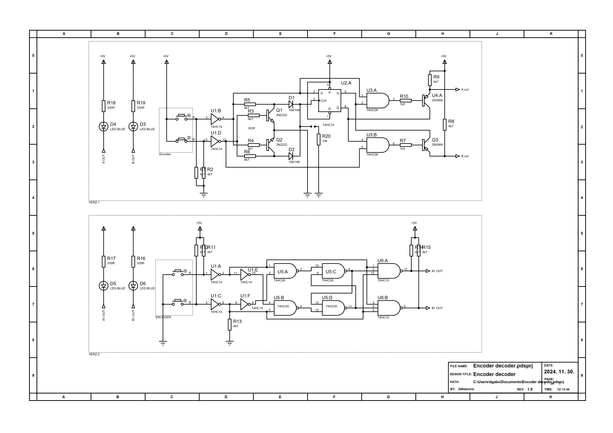

# Enkóder cmos dekódoló

## Kapcsolási rajz

Az enkóder 24 impulzusú.
Az adott forgásiránynak megfelelő kimeneten jelennek meg az impulzusok.
A kimenet alapból magas és alacsony impulzusok keletkeznek.
DDS generátorhoz készítettem hogy felváltsam a gombokat.
https://www.hestore.hu/prod_getfile.php?id=12049
